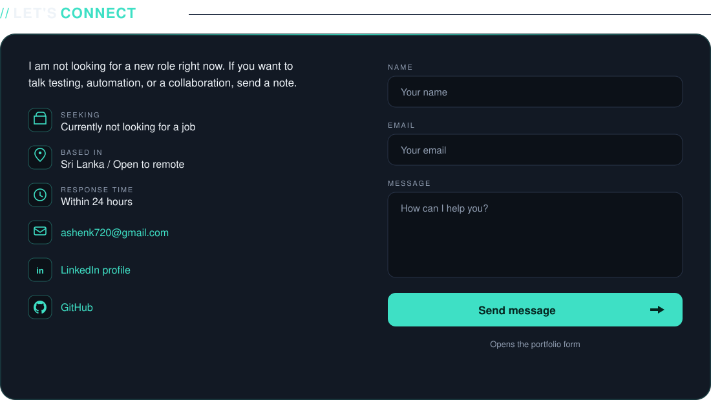

  

  <a href="https://portfolio-eight-neon-c4csi6obc0.vercel.app/">Portfolio</a>
  ·
  <a href="https://www.linkedin.com/in/ashenk97/">LinkedIn</a>
  ·
  <a href="mailto:ashenk720@gmail.com">Email</a>
  ·
  <a href="https://github.com/Ashenk97/Portfolio">This site on GitHub</a>

I focus on automation architecture, risk-based coverage, and software that holds up in production. I design Playwright and TypeScript suites, API and performance checks, and CI quality gates. I still go deep on manual and exploratory testing when the risk calls for it.

**QA Engineer at [WealthOS](https://github.com/Ashenk97)** · Kurunegala, Sri Lanka · ISTQB Certified Tester

 

## Now

| | |
| --- | --- |
| **Role** | Quality Assurance Engineer, WealthOS — wealth-tech, UI + API, Playwright / TypeScript |
| **Before that** | Software Quality Assurance Engineer, Pearson Lanka — User Engagement |
| **Certifications** | ISTQB Advanced Level Test Automation Engineering (Aug 2026) · Foundation Level (Mar 2025) |
| **Also** | Graphic design, and [GENKI](https://github.com/Ashenk97/Genki_Test) — streetwear I design and quality-gate |
| **Looking** | Not for a new role. Happy to talk testing, automation, or a collaboration |

 

## Stack I actually use

`Playwright` `TypeScript` `Selenium` `REST Assured` `Mocha` `Chai` `Postman` `JMeter` `SonarQube` `Java` `JavaScript` `Python` `MySQL` `MongoDB` `GitHub Actions` `JIRA` `Cursor` `Figma` `Adobe Photoshop` `Adobe Illustrator`

  
  

 

## Selected work

- **[Portfolio](https://github.com/Ashenk97/Portfolio)** — this site. Astro, Playwright on every push, live at the link above.
- **[GENKI](https://github.com/Ashenk97/Genki_Test)** — storefront treated like a product under test. Checkout, inventory, and visuals gated before a drop.
- **Self-healing E2E** — Playwright + TypeScript page objects. When a locator misses, a wrapper asks an LLM for a new selector and writes a healing report. Planning to do.

 

  

  © 2026 Ashen Kavinda. All rights reserved.

